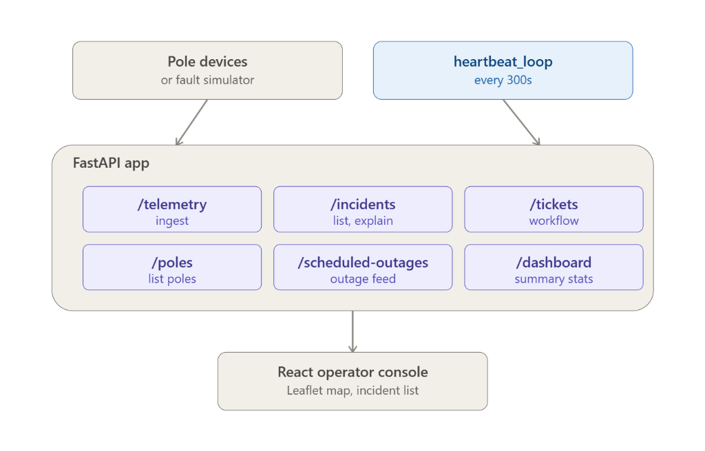
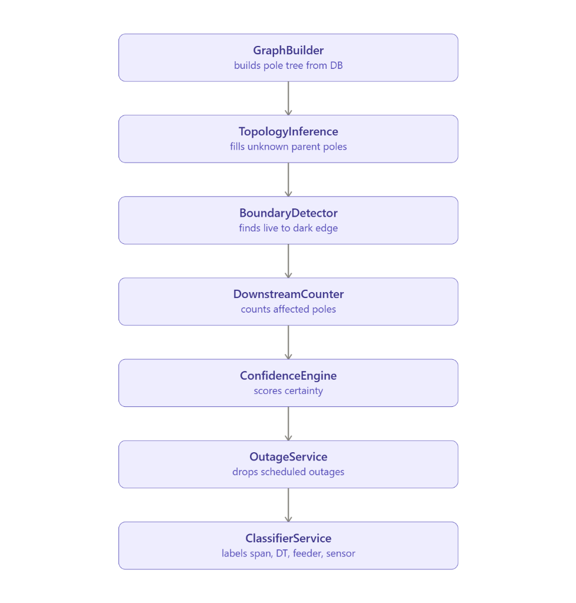
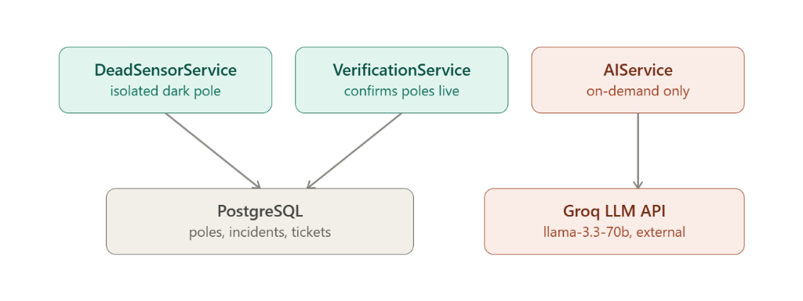

# System Architecture & Technical Design

This document details the architectural design, algorithmic decisions, data structures, and trade-offs underpinning the AI Power Grid Fault Localization System.

---

## Data Flow Diagram



*(Diagram: pole device → ingest → localization engine → incident/ticket store → operator console, showing the scheduled-outage suppression path and the AI-explain side-path.)*

---

## Data Sourcing & Ingestion Pipeline

Grid sensors deployed across distribution poles transmit real-time telemetry packets containing node state (energized vs dark), voltage, current, timestamp, and sequence number (`seq`).

### 1. Deduplication via Sequence Numbers
Telemetry ingestion handles high-frequency bursts and duplicate packets (e.g. 5x retransmissions over cellular networks):
- Each telemetry packet carries an incremental integer `seq`.
- Ingestion checks the last recorded sequence number for the device. If `incoming_seq <= last_seq`, the packet is flagged as a duplicate and discarded without triggering state re-evaluations or redundant DB writes.

### 2. Out-of-Order Packet Handling
Network delays can cause telemetry packets to arrive out of chronological order:
- Packets are evaluated against `last_telemetry_timestamp`. If an incoming packet has a timestamp older than the latest saved state for that node, the system ignores state transitions.
- Newer telemetry state always overrides stale, late-arriving packets.

### 3. Clock Skew Tolerance
Sensors at remote transformers or poles may experience clock drift relative to server time:
- Ingestion enforces a configurable clock skew window ($\pm 300$ seconds).
- Timestamps exceeding this skew threshold are normalized to server ingestion time before processing, preventing premature or delayed outage window evaluation.

---

## Topology Representation & Data Storage

Power distribution grids operate as hierarchical tree structures: **Substation $\rightarrow$ 11kV Feeder $\rightarrow$ Distribution Transformer $\rightarrow$ Low Voltage Spans $\rightarrow$ Consumer Poles**.

### Why Graph/Tree Structure Over Flat Tables?
A flat relational table cannot represent multi-hop downstream dependency paths efficiently. Determining which poles are impacted by an upstream conductor snap requires recursive ancestor/descendant queries.

1. **In-Memory NetworkX Graph (`GraphBuilder`)**:
   - Built on startup from PostgreSQL pole and connectivity tables.
   - Directed acyclic graph (DAG) where nodes represent poles/transformers and directed edges represent electrical spans flowing downstream.
   - Permits $O(V + E)$ graph traversal to instantly query subtrees, downstream node counts, and parent-child boundary states.

2. **PostgreSQL Relational Storage**:
   - Persists node metadata (coordinates, pincode, feeder_id, transformer_id, digitized flag).
   - Persists immutable incident logs and ticket status states (`DETECTED`, `ACKNOWLEDGED`, `IN_PROGRESS`, `VERIFIED`, `CLOSED`).

---

## Localization Algorithm

The core localization engine converts raw node-level state shifts into precise physical fault boundaries.

### Localization Pipeline Flow



*(Pipeline: GraphBuilder → TopologyInference → BoundaryDetector → DownstreamCounter → ConfidenceEngine → OutageService → ClassifierService)*

```
       [ Feeder / Substation ]
                 │
             (Pole P1) [LIVE]
                 │  <--- FAULT BOUNDARY (Span P1-P2)
             (Pole P2) [DARK]
            /        \
    (Pole P3) [DARK]  (Pole P4) [DARK]
```

### 1. Boundary Detection (Last-Live / First-Dark)
The algorithm inspects directed graph edges $(U, V)$ where $U$ is the parent node and $V$ is the child node:
- **Condition**: Parent node $U$ is `LIVE` (or connected directly to energized upstream line) and child node $V$ is `DARK`.
- The physical fault is localized to the span $(U, V)$ immediately preceding node $V$.

### 2. Shared Incident Grouping Logic
Early implementations suffered from a critical bug where 10 dark downstream poles created 10 separate incident tickets. To resolve this, all fault entry points pass through unified grouping logic:
- The system traverses the downstream subtree starting at boundary node $V$.
- All downstream dark poles are grouped into **exactly ONE Incident** anchored at the boundary span.
- **Feeder-Wide Blackouts**: If *every* transformer on an 11kV feeder becomes dark simultaneously, the engine collapses all individual transformer boundary alerts into a single `FEEDER_FAULT` incident with `transformer_id: MULTIPLE`.

### 3. Simultaneous Independent Faults
If two separate physical lines break concurrently on distinct branches (e.g. Feeder A Span 3 and Feeder B Span 7), the engine detects two independent $(U_1, V_1)$ and $(U_2, V_2)$ boundaries. Because downstream graph walks remain strictly within separate subtrees, two distinct incidents are generated without incorrect merging or splitting.

### 4. Confidence Scoring Engine
Confidence reflects topology certainty and boundary precision (base score: 100%):
- **Boundary Uncertainty Penalty**: If a boundary sits behind undigitized/no-sensor poles, a penalty is applied based on the range of unmonitored candidate poles.
- **Missing-Topology Penalty**: Applied when fault location involves inferred geometric edges.

### 5. Missing-Topology Approach (Geometric Inference)
Approximately 60% of distribution transformers in legacy grids lack digitized line ordering.
- **Spatial Inference**: Uses nearest-neighbor geometric algorithms (Delaunay/Voronoi proximity analysis) to infer downstream connection paths for unmapped transformers.
- **Evidence-Based Confidence Scaling**:
  - **Digitized Transformers**: $100\%$ confidence.
  - **Undigitized / Geometrically Inferred**: Confidence penalty is dynamically calculated based on spatial distance ($D_{meters}$). Measured test confidence values on undigitized transformers yielded **92%** and **87%**, complete with plain-language explanations (e.g. *"Inferred topology connection spanning 142m based on geometric proximity"*).

---

## Noise & False-Positive Handling

The system evaluates incoming telemetry against four distinct noise categories to guarantee zero false outage tickets:

| Noise Category | Telemetry Pattern | System Behavior | Resulting Ticket Action |
| :--- | :--- | :--- | :--- |
| **Dead Sensor Failure** | Single isolated node dark, but all downstream nodes report LIVE | Flagged as `SENSOR_FAILURE` | **No Outage Ticket**. Sensor maintenance alert flag only. |
| **Scheduled Outage** | Telemetry dark within an active maintenance window (`OutageService`) | Suppressed entirely by `is_within_scheduled_outage()` check | **Zero Tickets Created**. Suppressed count logged. |
| **Duplicate Packets** | Identical `seq` or identical state retransmitted 5x | Ingestion filter drops redundant packets | **Exactly 1 State Change**, zero duplicate tickets. |
| **Out-of-Order Packets** | Packet timestamp older than existing node timestamp | State transition skipped | **Latest State Retained**, no false state oscillation. |

---

## API Surface Specifications

| Endpoint | Method | Key Parameters / Body | Response / Description |
| :--- | :--- | :--- | :--- |
| `/incidents` | `GET` | None | Returns list of all active/historical grid incidents. |
| `/incidents/{id}` | `GET` | `incident_id` (path) | Returns detailed record for a specific incident. |
| `/incidents/{id}/status` | `PATCH` | `status` (query) | Updates status of an incident (`DETECTED`, `ACKNOWLEDGED`, etc.). |
| `/incidents/{id}/explain` | `POST` | `incident_id` (path) | Triggers on-demand Groq AI root cause analysis. |
| `/tickets` | `GET` | None | Returns all work order tickets with assigned status. |
| `/tickets/{id}` | `GET` | `ticket_id` (path) | Details of specific work order ticket. |
| `/tickets/{id}/status` | `PATCH` | `status` (query) | Updates ticket status (`OPEN`, `IN_PROGRESS`, etc.). |
| `/tickets/{id}/close` | `POST` | `ticket_id` (path) | **Admin Override**: Forces ticket status to `CLOSED` without telemetry verification. |
| `/telemetry` | `POST` | `TelemetryBatchSchema` | Ingests batch of sensor packets; runs localization engine. |
| `/dashboard` | `GET` | None | Summary stats (total poles, live vs dark ratio, active incidents, open tickets). |
| `/poles` | `GET` | `limit` (query, default 500) | Returns pole list with coordinates for GIS map rendering. |
| `/scheduled-outages` | `POST` | `OutageCreateSchema` | Registers a planned maintenance window on a feeder/transformer. |
| `/simulate/network` | `POST` | `reset` (bool query) | Seeds the synthetic network; pass `?reset=true` to wipe and regenerate. |
| `/simulate/span` | `POST` | `SpanFaultRequest` — `pole_ids: list[str]` | Marks a set of adjacent poles dark; runs localization pipeline. |
| `/simulate/transformer` | `POST` | `TransformerFaultRequest` — `transformer_id: str` | Takes every pole under one DT dark; runs localization pipeline. |
| `/simulate/feeder` | `POST` | `FeederFaultRequest` — `feeder_id: str` | Takes every transformer on a feeder dark; grouped into one FEEDER_FAULT ticket. |
| `/simulate/repair` | `POST` | `RepairRequest` — `pole_ids: list[str]` | Re-energizes span poles; triggers telemetry-driven verification pipeline. |
| `/simulate/repair/feeder` | `POST` | `FeederFaultRequest` — `feeder_id: str` | Re-energizes all poles on a feeder; triggers verification pipeline. |
| `/simulate/noise/sensor-failure` | `POST` | `SensorFaultRequest` — `pole_id: str` | Kills a device while power stays on — must NOT produce an outage ticket. |
| `/simulate/noise/duplicate-telemetry` | `POST` | `DuplicateTelemetryRequest` — `pole_id, repeat_count` | Resends same packet N times; exactly one state change must result. |
| `/simulate/noise/out-of-order` | `POST` | `OutOfOrderTelemetryRequest` — `pole_id: str` | Sends a stale `power_restored` after a newer `power_lost`; stale must not win. |

---

## UI / UX Design Rationale

The Operator Console is optimized for high-stress grid monitoring:

1. **Top Live/Dark Ratio Bar First**:
   - Grid operators need immediate situational awareness of total grid health. A prominent top stats bar displays total poles, live count, dark count, active incidents, and open tickets.

2. **Combined Map + List View**:
   - Spatial map rendering (Leaflet GIS) allows operators to visualize physical fault locations in relation to roads and geography, while the adjacent incident list provides structured tabular sorting by confidence and priority.

3. **Separated & De-emphasized Force-Close Action**:
   - The primary ticket resolution path is **Automated Telemetry Verification** (repair telemetry arrives $\rightarrow$ system auto-verifies and closes ticket).
   - Manual override is labeled **"Admin override: force-close without verification"** and styled distinctly to prevent operators from bypassing verification unintentionally.

---

## AI Root-Cause Explanation Model

The system incorporates an LLM-powered incident explanation module (`AIService`) using Groq (`llama-3.3-70b-versatile`):

### Auxiliary Services & External LLM Workflow



*(Workflow: DeadSensorService & VerificationService → PostgreSQL store; AIService → Groq LLM API)*

- **On-Demand Execution**: AI generation is strictly triggered when an operator clicks *"Explain this fault"* (`POST /incidents/{id}/explain`). It is **never** embedded in the critical telemetry ingestion loop.
- **Deterministic Safeguard**: Fault detection, incident creation, boundary calculation, and ticketing remain 100% deterministic code. If the AI service fails or times out, fault detection operates with zero impact.
- **Cost Model & Latency Control**: On-demand execution limits LLM API requests to manual operator investigations (zero cost during background streaming of millions of telemetry points).
- **Graceful Degradation**: If `GROQ_API_KEY` is missing or the external API raises an error, the backend catches the exception and returns HTTP 503 with plain-language error context while keeping all underlying incident/ticket data intact.

---

## Scale & Extension: One Subdivision to Thirty

The current design handles one city subdivision (~500 poles, 15 transformers, 3 feeders) comfortably. Here is an honest assessment of what extends cleanly and what would need rework at 30× scale.

### What extends without a rewrite

- **Localization algorithm**: `GraphBuilder`, `BoundaryDetector`, `TopologyInference`, and `DownstreamCounter` are all stateless, pure-graph functions. They operate identically whether the input graph has 500 nodes or 15,000. Complexity is O(V + E) per localization pass — linear in network size.
- **API surface**: All endpoints are subdivision-agnostic. Adding a `subdivision_id` filter parameter to `/incidents`, `/tickets`, and `/poles` requires a single query predicate change, not a structural redesign.
- **Telemetry ingestion**: The `POST /telemetry` endpoint processes packets independently per `pole_id`. No cross-pole state is held in memory during ingest — it scales horizontally by adding workers.
- **PostgreSQL schema**: Poles, transformers, and feeders already carry `feeder_id` and `transformer_id` as string identifiers. Adding a `subdivision_id` foreign key to each table is a single migration with no cascading schema changes.

### Where it would need work

- **In-memory graph per request**: `GraphBuilder.build()` currently loads the entire pole and transformer table on every localization pass and builds the full NetworkX graph in memory. For one subdivision this costs ~10 ms. For 30 subdivisions (~15,000 poles), the same approach would cost ~300 ms per pass and consume significantly more memory. The fix is straightforward — scope the query by `subdivision_id` and cache the graph per subdivision with an invalidation signal on telemetry ingest — but it is not implemented yet.
- **Single Uvicorn worker**: The backend runs one process with no message queue in front of `/telemetry`. At 39 msg/s for one subdivision this is fine. At 30 subdivisions (potentially 1,200 msg/s peak) the ingest endpoint would need an async queue (Redis Streams or Kafka) to buffer spikes without blocking the HTTP server.
- **Operator console**: The current UI has no subdivision selector — it renders all poles and incidents from the single seeded network. A multi-subdivision deployment would require a subdivision filter in the frontend and a scoped `/poles?subdivision_id=` query before the Leaflet map would remain readable.

In summary: the localization logic, schema, and API are subdivision-ready by design. The in-memory graph build strategy and single-worker ingest are the two known bottlenecks that a production multi-subdivision deployment would need to address first.

